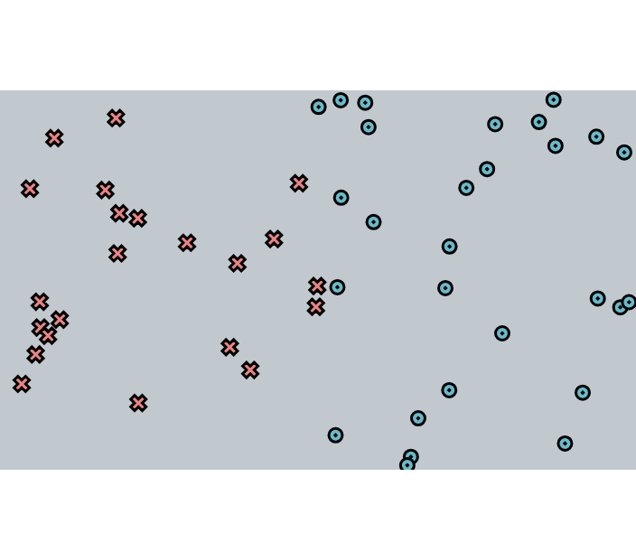
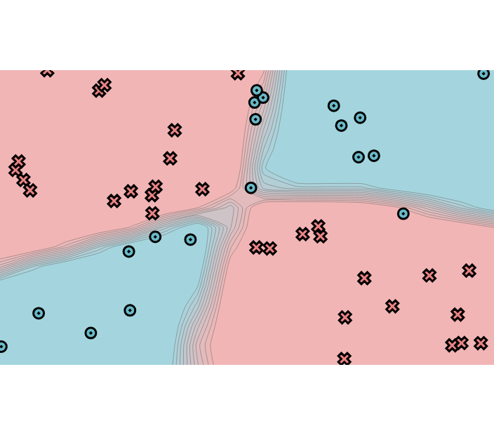
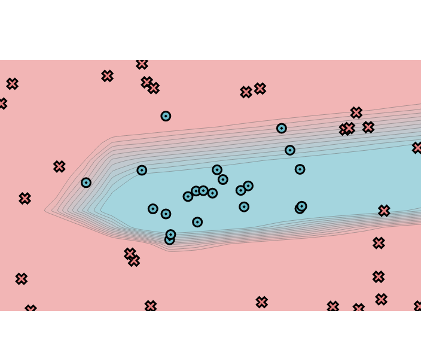

[](https://classroom.github.com/a/4ja02iT5)
# MiniTorch Module 1


* Docs: https://minitorch.github.io/

* Overview: https://minitorch.github.io/module1/module1/

<figure>
  
  <figcaption>Classified Image</figcaption>
</figure>

### Parameters used:

- *Dataset*: Simple
- *PTS*: 50
- *HIDDEN* = 2
- *RATE* = 0.5

<figure>
  
  <figcaption>XOR Classified Image</figcaption>
</figure>


### Parameters Used:

- *Dataset*: XOR
- *PTS*: 50
- *HIDDEN* = 10
- *RATE* = 0.5

<figure>
  
  <figcaption>XOR Classified Image</figcaption>
</figure>


### Parameters Used:

- *Dataset*: circle
- *PTS*: 50
- *HIDDEN* = 2
- *RATE* = 0.5

<figure>
  
  <figcaption>XOR Classified Image</figcaption>
</figure>


### Parameters Used:

- *Dataset*: circle
- *PTS*: 50
- *HIDDEN* = 2
- *RATE* = 0.5

<figure>
  
  <figcaption>XOR Classified Image</figcaption>
</figure>


### Parameters Used:

- *Dataset*: spiral
- *PTS*: 50
- *HIDDEN* = 2
- *RATE* = 0.5


This assignment requires the following files from the previous assignments. You can get these by running

```bash
python sync_previous_module.py previous-module-dir current-module-dir
```

The files that will be synced are:

        minitorch/operators.py minitorch/module.py tests/test_module.py tests/test_operators.py project/run_manual.py
